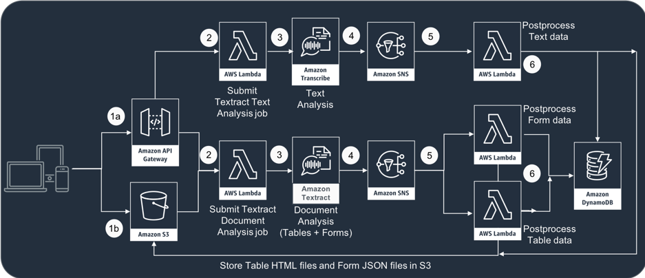
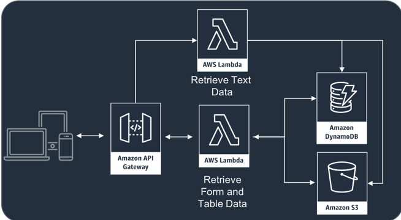

# Amazon Textract Enhancer - Overview

This workshop demonstrates how to build a text parser and feature extractor with Amazon Textract. With amazon Textract you can  detect text from a PDF document or a scanned image of a printed document to extract lines of text, using [Text Detection API](https://docs.aws.amazon.com/textract/latest/dg/API_DetectDocumentText.html). In addition, you can also use [Document Analysis API](https://docs.aws.amazon.com/textract/latest/dg/API_AnalyzeDocument.html) to extract tables and forms from the scanned document.

It is straightforward to invoke this APIs from AWS CLI or using Boto3 Python library and pass either a pointer to the document image stored in S3 or the raw image bytes to obtain results. However handling large volumes of documents this way becomes impractical for several reasons:
- Making a synchronous call to query Textract API is not possible for multi-page PDF documents
- Synchronous call will exceed provisioned throughput if used for a large number of documents within a short period of time
- If multiple query with same document is needed, triggerign multiple Textract API invocation, cost increases rapidly
- Textract sends analysis results with rich metadata, but the strucutres of tables and forms are not immediately apparent without some post-processing

In this Textract enhancer solution, as demonstrated in this workshop, following approaches are used to provide for a more robust end to end solution.
- Lambda functions triggered by document upload to specific S3 bucket to submit document analysis and text detection jobs to Textract
- API Gateway methods to trigger Textract job submission on-demand
- Asynchronous API calls to start [Document analysis](https://docs.aws.amazon.com/textract/latest/dg/API_StartDocumentAnalysis.html) and [Text detection](https://docs.aws.amazon.com/textract/latest/dg/API_StartDocumentTextDetection.html), with unique request token to prevent duplicate submissions
- Use of SNS topics to get notified on completion of Textract jobs
- Automatically triggered post processing Lambda functions to extract actual tables, forms and lines of text, stored in S3 for future querying
- Job status and metdata tracked in DynamoDB table, allowing for troubleshooting and easy querying of results
- API Gateway methods to retrieve results anytime without having to use Textract

## License Summary

This sample code is made available under a modified MIT license. See the [LICENSE](LICENSE) file.

## Prerequisites

In order to complete this workshop you'll need an AWS Account with access to create:
- AWS IAM Roles
- S3 Bucket
- S3 bucket policies
- SNS topics
- DynamoDB tables
- Lambda functions
- API Gateway endpoints and deployments
    
## 1. Launch stack

Textract Enhancer solution components can each be built by hand, either using [AWS Console](https://console.aws.amazon.com/) or using AWS CLI. [AWS Cloudformation](https://aws.amazon.com/cloudformation/) on the other hand provides mechanism to script the hard work of launching the whole stack. 

You can use the button below to launch the solution stack, the component details of which you can find in the following section.

Region| Launch
------|-----
US East (N. Virginia) | [](https://console.aws.amazon.com/cloudformation/home?region=us-east-1#/stacks/new?stackName=textract-enhancer&templateURL=https://s3.amazonaws.com/my-python-packages/textract-api-stack.json)


## 2. Architecture
<details><p>

The solution architecture is based solely upon serverless Lambda functions, invoking Textract API endpoints. The architecture uses Textract in asynchronous mode, and uses a DynamoDB table to keep track of job status and response location.
    

The solution also uses Rest API backed by another set of Lambda functions and the DynamoDB table to provide for fast querying of the resulting documents from S3 bucket.
    
</p></details>

## 3. Solution components
<details><p>

### 3.1. DyanmoDB Table
<details><p>

- When a Textract job is submitted in asynchronous mode, using a request token, it creates a unique job-id is created. For any subsequent submissions with same document, it prevents Textract from running the same job over again. Since in this solution, two different types of jobs are submitted, one for `DocumentAnalysis` and one for `TextDetection`, a DynamoDB table is used with `JobId` as HASH key and `JobType` as RANGE key, to track the status of the job.
- In order to facilitate table scan with the document location, the table also use a global secondary index, with `DocumentBucket` as HASH key and `DocumentPath` as RANGE key. This information is used by the retrieval functions later when an API request is sent to obtain the tables, forms and lines of texts.
- Upon completion of a job, post processing Lambda functions update the corresponding records in this DynamoDB table with location of the extracted files, as stored in S3 bucket, and other metadata such as completion time, number of pages, lines, tables and form fields.

<details>
<summary>Following snippet shows the schema definition used in defining the table (expand for details)</summary><p>

```
"AttributeDefinitions": [
    {
        "AttributeName": "JobId",
        "AttributeType": "S"
    },       
    {
        "AttributeName": "JobType",
        "AttributeType": "S"
    },                                
    {
        "AttributeName": "DocumentBucket",
        "AttributeType": "S"
    },
    {
        "AttributeName": "DocumentPath",
        "AttributeType": "S"
    }                    
],
"KeySchema": [
    {
        "AttributeName": "JobId",
        "KeyType": "HASH"
    },
    {
        "AttributeName": "JobType",
        "KeyType": "RANGE"
    }                    
],
"GlobalSecondaryIndexes": [
    {
        "IndexName": "DocumentIndex",
        "KeySchema": [
                {
                    "AttributeName": "DocumentBucket",
                    "KeyType": "HASH"
                },
                {
                    "AttributeName": "DocumentPath",
                    "KeyType": "RANGE"
                }
        ],
        "Projection": {
            "ProjectionType": "KEYS_ONLY"
        },
        "ProvisionedThroughput": {
                "ReadCapacityUnits": 5,
                "WriteCapacityUnits": 5
        }
    }
],   
```            
</p></details>
</p></details>

### 3.2. Lambda execution role
<details><p>

- Lambda functions used in this solution prototype uses a common execution role that allows it to assume the role, to which required policies are attached.
<details>
<summary>Following snippet shows the assume role policy document for the Lambda execution role (expand for details)</summary><p>

```
"AssumeRolePolicyDocument": {
    "Version": "2012-10-17",
    "Statement": [
        {
            "Effect": "Allow",
            "Principal": {
                "Service": [
                    "lambda.amazonaws.com"
                ]
            },
            "Action": [
                "sts:AssumeRole"
            ]
        }                       
    ]
}
```            
</p></details>

- Basic execution policy allows the Lambda functions to publish events to Cloudwatch logs.
<details>
<summary>Following snippet shows the basic execution role policy document (expand for details)</summary><p>

```
{
    "PolicyName": "lambda_basic_execution_policy",
    "PolicyDocument": {
        "Version": "2012-10-17",
        "Statement": [
            {
                "Effect": "Allow",
                "Action": [
                    "logs:CreateLogGroup",
                    "logs:CreateLogStream",
                    "logs:PutLogEvents"
                ],
                "Resource": "arn:aws:logs:*:*:*"
            },
            {
                "Effect": "Allow",
                "Action": [
                    "xray:PutTraceSegments"
                ],
                "Resource": "*"
            }                                
        ]
    }
}
```            
</p></details>

- Textract access policy attached to this role allows Lambda functions to execute Textract API calls.
<details>
<summary>Following snippet shows the Textract access policy document (expand for details)</summary><p>

```
{
    "PolicyName": "textract_access_policy",
    "PolicyDocument": {
        "Version": "2012-10-17",
        "Statement": [
            {
                "Effect": "Allow",
                "Action": "textract:*",
                "Resource": "*"
            }                             
        ]
    }
} 
```            
</p></details>

- DynamoDB access policy attached to this role allows Lambda functions to write records to and read records from the tracking table.
<details>
<summary>Following snippet shows the DynamoDB access policy document (expand for details)</summary><p>

```
{
    "PolicyName": "dynamodb_access_policy",
    "PolicyDocument": {
        "Version": "2012-10-17",
        "Statement": [
            {
                "Effect": "Allow",
                "Action": "dynamodb:*",
                "Resource": "*"
            }                             
        ]
    }
}
```            
</p></details>

- An IAM access policy is attached to this role, to enable the Lambda function because when invoked with a bucket name owned by another AWS account, the job submission Lambda function automatically creates an IAM policy and attaches to itself, thereby allowing access to documents stored in the provided bucket.
<details>
<summary>Following snippet shows the IAM access policy document (expand for details)</summary><p>

```
{
    "PolicyName": "iam_access_policy",
    "PolicyDocument": {
        "Version": "2012-10-17",
        "Statement": [
            {
                "Effect": "Allow",
                "Action": "iam:*",
                "Resource": "*"
            }                             
        ]
    }
}
```            
</p></details>
</p></details>

### 3.3. SNS Topic
<details><p>

- When submitting asynchronous jobs to Textract, an SNS topic needs to be specified, which textract uses to post the job completion messages. The messages posted to this topic would contain the same unique job-id that was generated and returned during submission API call. Subsequent retrieval calls will then use this job-id to obtain the results for the corresponding Textract jobs.
- Since `DocumentAnalaysis` and `TextDetection` are separate job types, that requires post processing by different Lambda functions, two different SNS topics are used, on order to have a clear separation of channels.
- The topic named `DocumentAnalysisJobStatusTopic` adds lambda protocol subscriptions for `TextractPostProcessTableFunction` and `TextractPostProcessFormFunction`. 
- The topic named `TextDetectionJobStatusTopic` adds lambda protocol subscription for `TextractPostProcessTextFunction`. 
</p></details>

### 3.4. Textract service role
<details><p>

- In order to be able to publish job completion messages to specified SNS topic, Textract also needs to assume a role that has policies attahced, allowing publlish access to the respective topics. This service role needs to be created and the ARN passed to textract with the asynchronous job submission.
<details>
<summary>Following snippet shows the assume role policy document for the Textract service role (expand for details)</summary><p>

```
"AssumeRolePolicyDocument": {
    "Version": "2012-10-17",
    "Statement": [
        {
            "Effect": "Allow",
            "Principal": {
                "Service": [
                    "textract.amazonaws.com"
                ]
            },
            "Action": [
                "sts:AssumeRole"
            ]
        }                       
    ]
}
```   
</p></details>

- Since we use two different SNS topics, the policies attached to this role needs to allow publish access to both of these topics.
<details>
<summary>Following snippet shows the policy document with policies allowing access to both topics (expand for details)</summary><p>

``` 
"PolicyDocument": {
    "Version": "2012-10-17",
    "Statement": [
        {
            "Effect": "Allow",
            "Action": [
                "sns:Publish"
            ],
            "Resource": {"Ref" : "DocumentAnalysisJobStatusTopic"}
        },
        {
            "Effect": "Allow",
            "Action": [
                "sns:Publish"
            ],
            "Resource": {"Ref" : "TextDetectionJobStatusTopic"}
        }                                                                
    ]
}
``` 
</p></details>
</p></details>

### 3.5. Job submission - Lambda function
<details><p>

- A Lambda function, named `TextractAsyncJobSubmitFunction` is used to invoke both `DocumentAnalysis` and `TextDetection` API calls to Textract. Several environment variables are passed to this function:
    - `document_analysis_token_prefix`: an unique string used to identify the document analysis jobs. This is used alongwith the bucket and document name to indicate to Textract the uniqueness of submissions. Based on this, Textract wither runs a fresh job or responds with a job-id generated during a prior submission of same document. 
    - `text_detection_token_prefix`: an unique string used to identify the text detection jobs. This is used alongwith the bucket and document name to indicate to Textract the uniqueness of submissions. Based on this, Textract wither runs a fresh job or responds with a job-id generated during a prior submission of same document.
    - `document_analysis_topic_arn`: Specifies the SNS topic to which job completion messages for document analysis jobs will be posted. 
    - `text_detection_topic_arn`: Specifies the SNS topic to which job completion messages for text detection jobs will be posted.
    - `role_name`: Textract service role to which policies allowing message publication to the two previously mentioned topics are added.
    - `retry_interval`: Value in seconds specifying how long the function should wait if a submission fails. When lot of submission requests arrive within a short time, either through exposed Rest API, or due to bulk upload of documents to S3 bucket, Textract API throughput exceeds. By waiting for a certain interval before retrying another attempted submission ensures that all documents gets their turn to be processed.
    - `max_retry_attempt`: Sometimes, due to large volume of requests, some might keep failing consistently. By specifying a maximum number of attempts, the solution allows us to gracefully exit out of the processing pipeleine. This feature, alongwith tracking metadata in DynamoDB table can then be used to manually submit the request later, using the Rest API interface.
- The job submission function executes the following actions, when invoked:
    - Attach S3 access policy to the execution role it is using for itself (allowing invocation using documents either using own S3 buckets, or hosted on an external S3 bucket)
    - Submit document analysis job using `start_document_analysis` method
    - Submit text detection job using `start_document_text_detection` method
    - Create or update DynamoDB records for both job types
</p></details>

### 3.6. Post Processing - Lambda functions
<details><p>

- There are 3 separate Lambda functions, all triggered when job completion messages are posted by Textract to the respective SNS topics.
- A Lambda function, named `TextractPostProcessTableFunction` is triggered when a `DocumentAnalysis` job completion message is posted to `DocumentAnalysisJobStatusTopic`. Once invoked, this function executes following actions:
    - Obtain unique Job-Id and Document location from the posted message
    - Retrieve result of the analysis using `get_document_analysis` API
    - Parses the JSON dictionary from Textract response to extract all Table and Cell Blocks as a list of key value maps
    - Convert each map of Table and Cell blocks to generate an XML structure, using HTML tags to indicate tables, rows and columns
    - Save the extracted tables as one HTML file each under a upload folder marked by the job-id, created underneath the document location folder in the same S3 bucket
    - Update the DynamoDB record for the correpsonding JobId and JobType with completion information, result metadata (number of tables and pages), and the location on S3 bucket where the resulting files are uploaded.
- A Lambda function, named `TextractPostProcessFormFunction` is triggered when a `DocumentAnalysis` job completion message is posted to `DocumentAnalysisJobStatusTopic`. Once invoked, this function executes following actions:
    - Obtain unique Job-Id and Document location from the posted message
    - Retrieve result of the analysis using `get_document_analysis` API
    - Groups all blocks present in the Textract response by block types, and selects all Keys and Values having child relationships
    - Gather all identified key-value pairs in a JSON dictionary
    - Save the JSON dictionary with key-value mappings as a file under a upload folder marked by the job-id, created underneath the document location folder in the same S3 bucket
    - Update the DynamoDB record for the correpsonding JobId and JobType with completion information, result metadata (number of form fields ), and the location on S3 bucket where the resulting file is uploaded.
- A Lambda function, named `TextractPostProcessTextFunction` is triggered when a `TextDetection` job completion message is posted to `TextDetectionJobStatusTopic`. Once invoked, this function executes following actions:
    - Obtain unique Job-Id and Document location from the posted message
    - Retrieve result of the analysis using `get_document_text_detection` API
    - Groups all blocks present in the Textract response by block types, and captures all texts by selecting all Line type blocks that are present as children of Page type blocks
    - Gather all identified lines of texts as a JSON dictionary with Line number being the key and Line text the value
    - These dictionary elements are nested within outer dictionary with Page number as keys
    - Save the extracted lines as JSON file under a upload folder marked by the job-id, created underneath the document location folder in the same S3 bucket
    - Update the DynamoDB record for the correpsonding JobId and JobType with completion information, result metadata (number of pages and lines), and the location on S3 bucket where the resulting files are uploaded.
</p></details>

### 3.7. S3 Bucket
<details><p>

- An S3 bucket is used as a staging area where the documents that needs to be analysed are uploaded. The same bucket is also used to store the analysis results.
- This bucket is configures with triggers such that whenever a docuemtn image (PDF or JPEG) is uploaded, the lambda function for job submission gets triggered, and submits the uploaded document to Textract for processing.
- Bucket policy attached to this bucket is used to extend read/write access to this bucket for the Lambda execution role. The advantage of doing so instead of adding policy statements with S3 access during the execution role declaration is that, it serves to show how such access can be extended and revoked at run-time. In fact, when the job submission function is triggered by invoking the API method with external bucket name, the submission function first creates a policy to grant the Lambda execution role with required read/write access to the specified bucket.
</p></details>

### 3.8. Result Retrieval - Lambda functions
<details><p>

- After the post processing is completed the results are stored in JSON and HTML files (as appropriate) under the folders marked by unique Job-Ids for the corresponding documents. 
- The solution includes two Lambda functions - `TextractDocumentAnalysisResultRetrievalFunction` and `TextractTextDetectionResultRetrievalFunction`, that when invoked with document name and bucket location, scans the DynamoDB table to get the document metadata, and returns the same, alongwith actual content of the resulting files, fetched from the S3 bucket location.
- The retrieval functions provides a way for on-demand querying of the Textract results, without actually sending a request to Textract everytime the document results are needed.
</p></details>

### 3.9. Rest API
<details><p>

- Retrieval functions can be used programmatically to acces the Textract results anytime, but that works only when the user is an authenticated IAM user of the same AWS account. Rest API create using Amazon API Gateway expands this capability to outside the acocunt boundary.
- The Rest API invokes an endpoint to trigger a Textract job submission, and two endpoints to extract the results of document analysis and text detection.
- `submittextanalysisjob` method can be invoked with two parameters - Bucket and Document, which in turn invokes `TextractAsyncJobSubmitFunction` Lambda function and submits the specifies document for document analysis and text detection processing.
- `retrievedocumentanalysisresult` method can be invoked with parameters - Bucket, Document, and optionally ResultType, which in turn invokes `TextractDocumentAnalysisResultRetrievalFunction` Lambda function to return tables, forms or both.
- `retrievetextdetectionresult` method can be invoked with parameters - Bucket, Document, which in turn invokes `TextractTextDetectionResultRetrievalFunction` Lambda function to return lines of texts grouped by pages.
</p></details>
</p></details>


## 4. Usage Instructions
<details><p>

- Textract Job start by document upload to bucket 
    - Once the stack gets deployed, it creates an S3 bucket, to be used as a staging bucket. Notice that during creation, the AWS Account-Id gets added to the chosen name of the S3 bucket, to ensure uniqueness of bocket name.
    - Open the bucket, as specified in the Cloudformation stack output, in S3 console, and optionally create folders and subfolders (if needed, to group your documents)
    - Upload scanned image of a printed document or PDF document containing texts anywhere on the bucket, and wait for few seconds to minutes, depending on the number of pages and amount of text.
    - During this time, you can check the Cloudwatch Log output for `TextractAsyncJobSubmitFunction` Lambda function to ensure that the function is triggered and submitting the two jobs to Textract
    - You can also open the DynamoDB table, as marked in the stack output, in the console, and verify that 2 rows have been created, that contains job-id, job-type, bucket, document, and start-timestamp.
    - After a while, you can refresh the table items, and notice that the records got updated with completion-timestamp, numbers of pages, lines, form-fields, tables, and upload locations of the resulting files for 3 kinds of outputs.
    - Alongside, you can also monitor Cloudwatch Log outputs for all 3 post processing Lambda functions - `TextractPostProcessTableFunction`, `TextractPostProcessFormFunction`, and `TextractPostProcessTextFunction`, to ensure that all of those got triggered, retrieved the raw results from Textract, finished post-processing and uploaded the results to S3 bucket.

- Textract Job start by API Invocation
    - If you already have documents present in bucket, or not the owner of the bucket, you can still trigger the same workflow as above, by sending a request to Rest API method as follows:
        https://deployment-id.execute-api.us-east-1.amazonaws.com/demo/submittextanalysisjob?Bucket=your-bucket-name&Document=your-document-key
    You can find the deployment-id of the API from the stack output.
    - Notice however that when you are running with an S3 bucket owned by a different AWS account that the one running this solution, you need to first add the following to the origin bucket policy (where source-account-id is the account-id of the AWS account where the solution stack is deployed):
    ```
    {
        "Version": "2012-10-17",
        "Statement": [
            {
                "Effect": "Allow",
                "Principal": {
                    "AWS": "arn:aws:iam::source-account-id:role/LambdaTextractRole"
                },
                "Action": [
                    "s3:GetObject",
                    "s3:GetObjectVersion",
                    "s3:PutObject",
                    "s3:PutObjectAcl"
                ],
                "Resource": "arn:aws:s3:::/*"
            },
            {
                "Effect": "Allow",
                "Principal": {
                    "AWS": "arn:aws:iam::source-account-id:role/LambdaTextractRole"
                },
                "Action": [
                    "s3:ListBucket",
                    "s3:ListBucketVersions"
                ],
                "Resource": "arn:aws:s3:::"
            }
        ]
    }
    ```
- Textract result retrieval via Rest API
    - If the initial submission goes well, and does not exceed provisioned throughput for maximum number of trials, result will be ready and post-processed within few seconds to minutes.
    - At that point, the document analysis result can be retrieved by invoking Rest API method as follows:
        https://deployment-id.execute-api.us-east-1.amazonaws.com/demo/retrievedocumentanalysisresult?Bucket=your-bucket-name&Document=your-document-key&ResultType=ALL|TABLE|FORM
    - Similarly text detection result can be obtained by invoking Rest API method as follows:
        https://deployment-id.execute-api.us-east-1.amazonaws.com/demo/retrievetextdetectionresult?Bucket=your-bucket-name&Document=your-document-key
    You can find the deployment-id of the API from the stack output.
    - In both cases, the API response will contain a list of files on S3 bucket where the results are stored for future use. You can also download and open the result files, either to inspect the contents manually, or to feed in to some downstream application/processes, as needed.
</p></details>